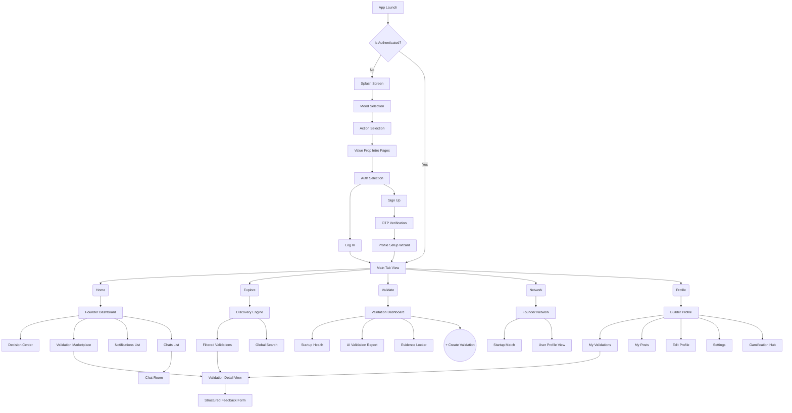
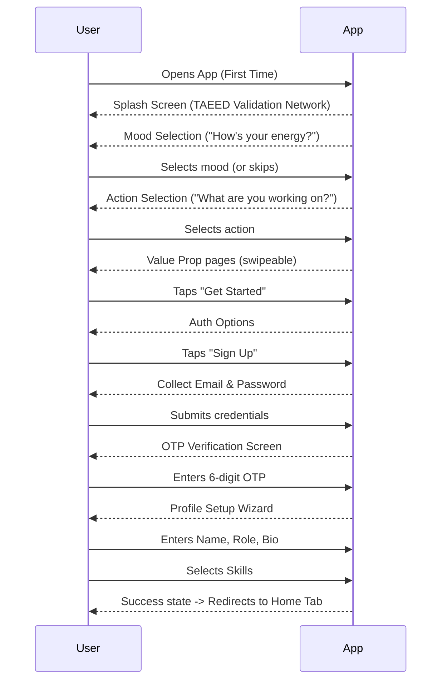
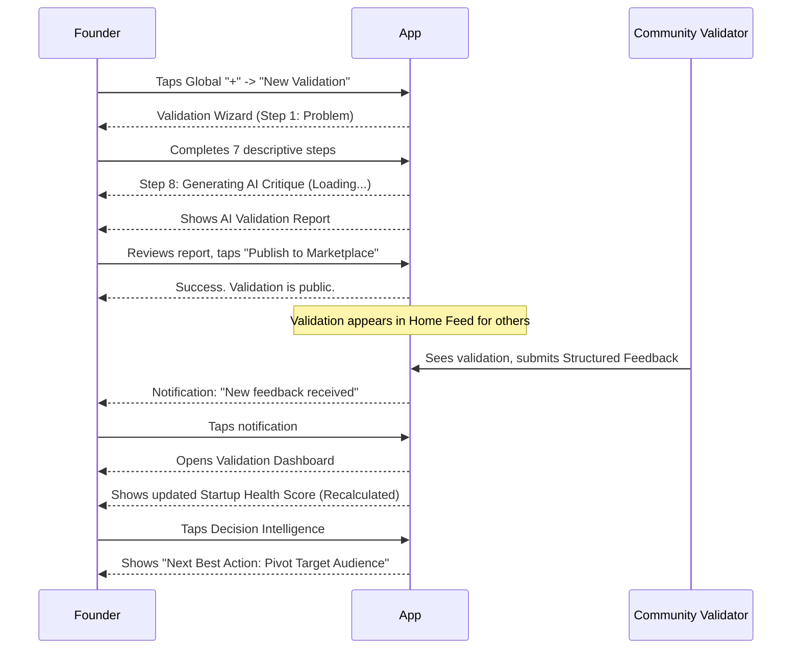
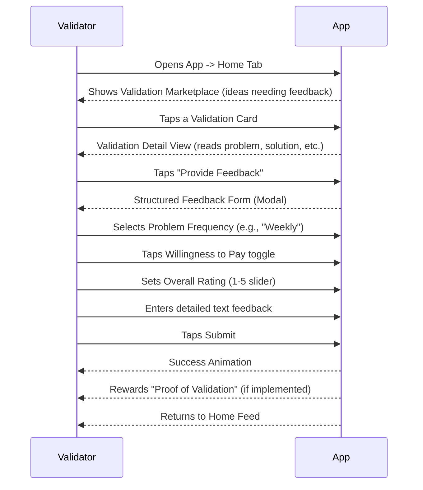
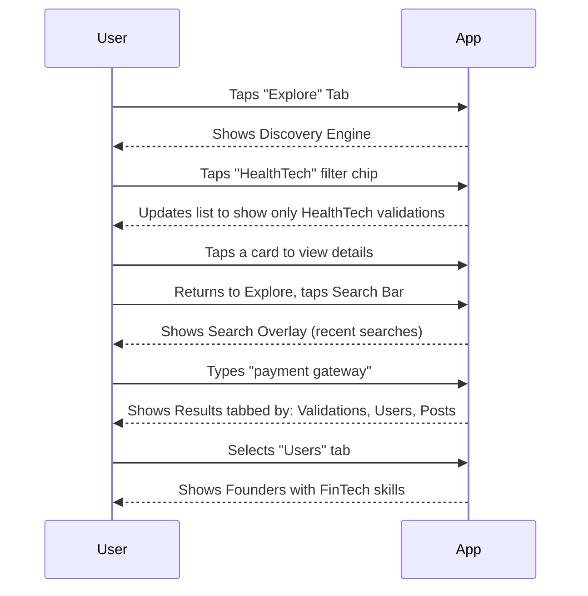
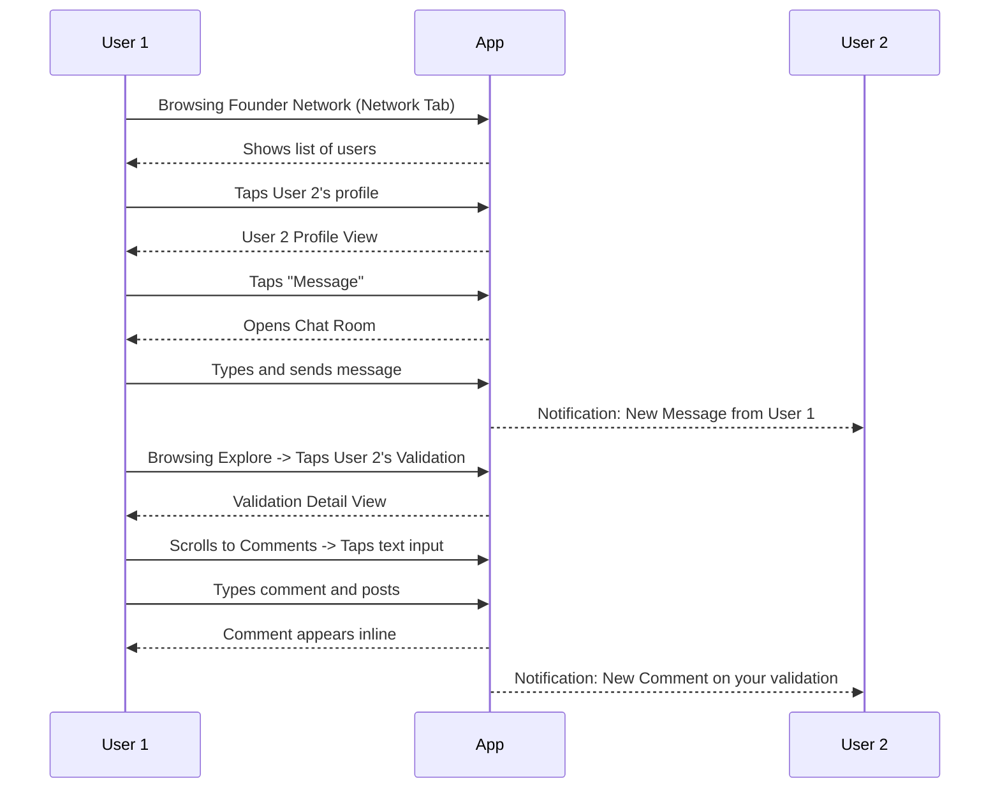

# DOCUMENT 06 — USER FLOWS & INFORMATION ARCHITECTURE

**Document ID:** DOC-06  
**Version:** 1.0  
**Last Updated:** 2026-08-20  
**Owner:** UX Design / Product  
**Status:** Draft  
**Upstream Dependencies:** DOC-04 (Rules), DOC-05 (Feature Catalogue)  
**Downstream Dependents:** DOC-07 (Screen Inventory), DOC-08 (UX Spec)

---

## Table of Contents

1. [Information Architecture (Sitemap)](#1-information-architecture-sitemap)
2. [Global Navigation Rules](#2-global-navigation-rules)
3. [UF-100: Onboarding & Authentication Flow](#3-uf-100-onboarding--authentication-flow)
4. [UF-200: Core Validation Flow (Founder)](#4-uf-200-core-validation-flow-founder)
5. [UF-300: Core Feedback Flow (Validator)](#5-uf-300-core-feedback-flow-validator)
6. [UF-400: Discovery Flow](#6-uf-400-discovery-flow)
7. [UF-500: Communication Flow](#7-uf-500-communication-flow)
8. [Decision Registry Extract](#8-decision-registry-extract)
9. [Document Status](#9-document-status)

---

## 1. Information Architecture (Sitemap)

**IA-001**

TAEED utilizes a flat, tab-based information architecture anchored by a persistent bottom navigation bar.

---

## 2. Global Navigation Rules

**IA-002**

| Rule | Description | Traceability |
|------|-------------|--------------|
| **Primary Navigation** | 5-tab bottom bar: Home, Explore, Validate (Center Prominent), Network, Profile. | DEC-021 |
| **Header Navigation** | Contextual. On root tabs, typically contains Search (left), Chat (right), Notifications (right). | FREQ-025 |
| **Floating Actions** | Global "Create" FAB on most screens. AI Mentor FAB on Home. | FREQ-026, FREQ-027 |
| **Deep Linking** | Validation Details, User Profiles, and specific Posts must be deep-linkable. | DEC-003 |
| **Modal Patterns** | Creation flows (Validation Wizard, New Post, Feedback Form) open as full-screen modals to preserve context beneath. | UX Standard |
| **Sheet Patterns** | AI Mentor, Action Menus, and quick interactions open as bottom sheets. | UX Standard |

---

## 3. UF-100: Onboarding & Authentication Flow

**FLOW-100**

**Goal:** Get the user from app launch to a verified, setup account ready to validate.

---

## 4. UF-200: Core Validation Flow (Founder)

**FLOW-200**

**Goal:** Founder creates a validation request, receives AI analysis, and tracks incoming feedback.

---

## 5. UF-300: Core Feedback Flow (Validator)

**FLOW-300**

**Goal:** Validator discovers a startup idea and provides structured feedback.

---

## 6. UF-400: Discovery Flow

**FLOW-400**

**Goal:** User searches for specific content or browses by category.

---

## 7. UF-500: Communication Flow

**FLOW-500**

**Goal:** User interacts with another user via direct message or post comment.

---

## 8. Decision Registry Extract

No new deterministic rules or overarching decisions are established in this document. It serves to orchestrate the features defined in DOC-05 according to the rules defined in DOC-04.

---

## 9. Document Status

**STATUS:** Draft  
**REVIEW STATE:** Needs Review

### Consistency Check Against Upstream Docs

| Check | Result |
|-------|--------|
| Navigation matches DEC-021 (5 bottom tabs). | ✅ |
| Validation Wizard flow matches DEC-016 (8 steps). | ✅ |
| Structured Feedback form flow matches DEC-017. | ✅ |
| No self-feedback possible in UF-300 (adheres to DEC-028). | ✅ |
| Deep linking architecture supports notification routing (RULE-012-G). | ✅ |

### Next Actions

1. Proceed to DOC-07 (Screen & Page Inventory).
